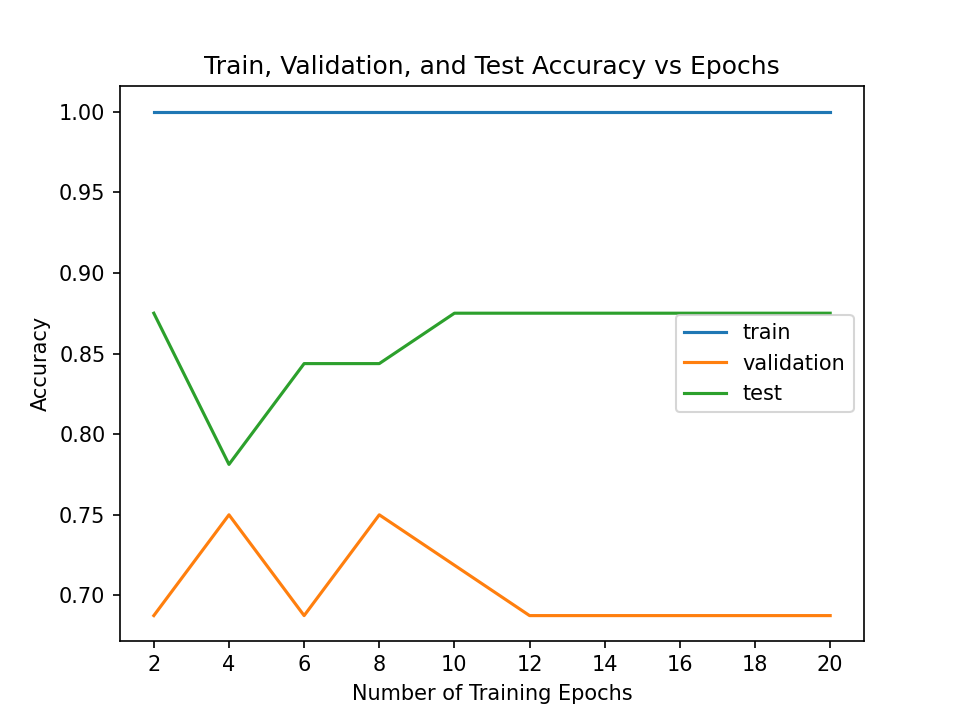

# TakeMeter

_Krish A. Patel_

_CodePath AI201: Applications of AI Engineering Project 3 (Summer 2026)_

Posts in online forums often can be categorized by discourse quality (e.g. reaction, review, hot take, etc.). I chose to focus on a [Reddit megathread](https://www.reddit.com/r/popheads/comments/7brx3o/megathread_taylor_swift_reputation/) about Taylor Swift's 6th studio album, _reputation_. This megathread contains thousands of posts from around the album's launch. Some talked about the actual songs on the album, some talked about the records being broken by the album in the first few hours, and some simply expressed pure excitement and enthusiasm. One can intuitively notice these distinct types of post - but the challenge is translating this nebulous intuition into a well-defined recipe so that machine learning models can successfully identify and classify different types of posts. Developing an accurate classifier would allow users to filter posts by discourse quality: a user that is strictly interested in opinions on the album can filter out the news around the album and fan excitement.

Most of the data loading, training, and evaluation code was given to me at the start of the project. My main job was to devise clear label definitions, collect and annotate 200+ samples, run and tune the classifier, and communicate the results. Since it was my first time embarking on a data collection project of this scale on my own, I encountered various obstacles along the way that allowed me to appreciate the art of data annotation as well as model fine-tuning.

## Demo

[TODO]

## Tech Stack

| Component                | Technology                                       |
| ------------------------ | ------------------------------------------------ |
| Data collection          | Manual                                           |
| Data annotation          | Mostly manual; some AI-assisted + human-reviewed |
| Baseline LLM model       | `llama-3.3-70b-versatile` (API-based)            |
| Fine-tuned encoder model | `distilbert-base-uncased` (local)                |
| Evaluation pipeline      | Sklearn                                          |
| Interface                | Gradio                                           |

## Setup

[TODO] ADD THE IPYNB

### Main Notebook

#### Option 1: Run Locally

1. Create a virtual environment:

```bash
python3 -m venv .venv
```

2. Install dependencies:

```bash
pip install -r requirements_data_overview.txt
```

3. Populate the environment variables:

```bash
cp .env.example .env
```

Update `GROQ_API_KEY` with your API key (freely available on [Groq](https://console.groq.com/keys)).

4. In [], set the kernel to the newly created virtual environment. [TODO]
5. Run all the cells. Execution depends on your hardware but may take 5-15 minutes.

#### Option 2: Run on Colab

1. Download the [] Jupyter notebook.
2. Go to [Google Colab](https://colab.research.google.com/).
3. Go to **File** > **Upload notebook**, and select the downloaded notebook.
4. Go to **Runtime** > **Change runtime type**, and make sure that **Hardware accelerator** is set to **T4 GPU**. Click **Save**.
5. Get a free [Groq](https://console.groq.com/keys) API key.
6. Go to **Secrets** (key icon on the left), set "GROQ_API_KEY" to your Groq API key, and enable **Notebook access**.
7. Download [`data/data.csv`](./data/data.csv).
8. Run all the cells, and upload `data.csv` when prompted in Section 1. Execution should take 5-15 minutes.

### (Optional) Data Overview

1. Create a virtual environment:

```bash
python3 -m venv .venv
```

2. Install dependencies:

```bash
pip install -r requirements_data_overview.txt
```

3. In [`data/data_overview.ipynb`](./data/data_overview.ipynb), set the kernel to the newly created virtual environment.
4. Run all the cells.

## Data Collection

- **Source**: posts in the [Taylor Swift reputation Reddit megathread](https://www.reddit.com/r/popheads/comments/7brx3o/megathread_taylor_swift_reputation/)
- **Method**: manual (copy-pasting, no scraping)
- **Selection criteria**:

| Criterion                                                   | Reason                                                                                      |
| ----------------------------------------------------------- | ------------------------------------------------------------------------------------------- |
| Only direct comments to the original post (no sub-comments) | Sub-comments tend to diverge from the main topic; discourse quality possibly very different |
| No posts with fully spelled-out curse words                 | Personal decision                                                                           |
| No posts from deleted users                                 | Ensure visible username and a variety of linguistic styles                                  |

## Labels

Each post in the megathread can be classified into one of 3 labels:

- `artistic_critique` - Primarily contains analysis of the artwork itself and artistic choices (e.g., sound, composition, melody, rhythm, lyrics, genre, production, album song order, artistic evolution, comparisons with other artistic works, etc). Also includes emotions and opinions expressed because of the artwork and artistic choices. Tone must be mostly matter-of-fact with minimal to no joking, slang, caps, etc.
  - **Example**: "Wow this album is not good. I was hoping for something in the vein of 1989 and this is... not."
- `external_narrative` - Primarily contains stories or discussion about the broader context (e.g. current events, gossip, celebrity feuds/drama, Billboard charts, sales, reviews, etc.). Includes personal context too, such as discussion about people and situations around the post publisher (e.g. mentions of family, friends, roommates; decisions to buy the album; etc.). Tone must be mostly matter-of-fact with minimal to no joking, slang, caps, etc.
  - **Example**: "Just got my Target magazine exclusive version in the mail! Can't wait to hear Reputation. Interested in hearing where Taylor is after 1989 and the whole Kanye debacle."
- `fandom_expression` - Primarily contains standalone emotional assertions, visceral reactions, or pure exclamations without much logic or elaboration (e.g., hype, witty remark, meta-joke, exaggeration, etc.). Sometimes can mix in artwork opinions and current event mentions, but is often distinguishable by a strong use of slang, all caps, emojis, etc.
  - **Example**: "I LIVED AND DIED WAITING FOR THIS ALBUM UP UNTIL NOW BUT MY SNAKE QUEEN HAS RESURRECTED ME AND I AM HERE TO PRAY"

Even with specific definitions, there will be cases with ambiguous labeling. For example, a post may include both gossip from the music industry and a brief note about the lyrical structure of a song. Should that be classified as `artistic_critique` or `external_narrative`? Another post may be talking about album leaks but uses all caps and repeated letters (e.g. "OMGGGGG IT LEAKED") - is this `external_narrative` or `fandom_expression`?

Thus, ambiguity resolution guidelines are needed to ensure consistent annotations, overriding any earlier notions that vary from annotator to annotator:

1. Don't look at content alone - check the tone too. An overly informal tone with a heavy use of slang, caps, etc. is a strong case for `fandom_expression`.
2. Choose the label that represents the at least 2/3 of the post's content. When using this criterion, there should be a clear winner.
3. If there's roughly an equal distribution of post content that can match multiple labels, and the decision is between `artistic_critique` and `external_narrative`, choose the label that forms the main idea or conclusion reached in the post. For example, if celebrity feuds are cited as the reason for a song's beat, then `artistic_critique` takes precedence. Additionally quoted content should not be used as the basis for classification. For example, if someone talks about reviews and pastes a long quote from a review site, the post is still `external_narrative` even if most of the post content may now technically be feedback-oriented due to the excerpt.
4. If there is no clear main idea or conclusion in the post, or if one of the label candidates is `fandom_expression`, use this strict prioritization: `artistic_critique` takes priority over `external_narrative`, which takes priority over `fandom_expression`.

The last step uses strict prioritization as per post importance: it's more useful to highlight `artistic_critique` posts to a potential new album buyer or everyday music enjoyer than `external_narrative`, which are both much more knowledge than `fandom_expression`.

It's important to realize that this project does _not_ involve sentiment analysis. All of these labels may contain both positive and negative ideas or emotions: a post liking/disliking the album, talking about album success/failure, or showing raw excitement/anger.

## Data Overview

I originally aimed to ensure posts from unique users only, but that became unsustainable in light of my 200-sample goal. I dropped that requirement, but the user variety still turned remained strong. I also consciously selected posts to balance the labels as much as possible. To my surprise, `fandom_expression`s were quite rare compared to the other two types of posts especially when combined with my selection criteria above (e.g. deleted users posted a good number of `fandom_expression`s).

```
213 entries
169 unique post authors
25 human-reviewed AI annotations

Label distribution:
artistic_critique    89   41.78%
external_narrative   84   39.44%
fandom_expression    40   18.78%
```

## Baseline Classification

Using a baseline model helps see where a fine-tuned shines. I performed zero-shot classification via Groq's `llama-3.3-70b-versatile` to see how a pre-trained LLM would perform on a detailed classification task.

<details>

<summary>System prompt</summary>

> You are classifying posts from Taylor Swift's reputation album release Reddit megathread.
> Assign each post to exactly one of the following categories.
>
> artistic_critique: Primarily contains analysis of the artwork itself and artistic choices (e.g., sound, composition, melody, rhythm, lyrics, genre, production, album song order, artistic evolution, comparisons with other artistic works, etc). Also includes emotions and opinions expressed because of the artwork and artistic choices. Tone must be mostly matter-of-fact with minimal to no joking, slang, caps, etc.
> Example: "Wow this album is not good. I was hoping for something in the vein of 1989 and this is... not."
>
> external_narrative: Primarily contains stories or discussion about the broader context (e.g. current events, gossip, celebrity feuds/drama, Billboard charts, sales, reviews, etc.). Includes personal context too, such as discussion about people and situations around the post publisher (e.g. mentions of family, friends, roommates; decisions to buy the album; etc.). Tone must be mostly matter-of-fact with minimal to no joking, slang, caps, etc.
> Example: "Just got my Target magazine exclusive version in the mail! Can't wait to hear Reputation. Interested in hearing where Taylor is after 1989 and the whole Kanye debacle."
>
> fandom_expression: Primarily contains standalone emotional assertions, visceral reactions, or pure exclamations without much logic or elaboration (e.g., hype, witty remark, meta-joke, exaggeration, etc.). Sometimes can mix in artwork opinions and current event mentions, but is often distinguishable by a strong use of slang, all caps, emojis, etc.
> Example: "I LIVED AND DIED WAITING FOR THIS ALBUM UP UNTIL NOW BUT MY SNAKE QUEEN HAS RESURRECTED ME AND I AM HERE TO PRAY"
>
> To resolve ambiguous cases, follow these guidelines in order:
>
> 1. Don't look at content alone - check the tone too. An overly informal tone with a heavy use of slang, caps, etc. is a strong case for `fandom_expression`.
> 2. Choose the label that represents the at least 2/3 of the post's content. When using this criterion, there should be a clear winner.
> 3. If there's roughly an equal distribution of post content that can match multiple labels, and the decision is between `artistic_critique` and `external_narrative`, choose the label that forms the main idea or conclusion reached in the post. For example, if celebrity feuds are cited as the reason for a song's beat, then `artistic_critique` takes precedence. Additionally quoted content should not be used as the basis for classification. For example, if someone talks about reviews and pastes a long quote from a review site, the post is still `external_narrative` even if most of the post content may now technically be feedback-oriented due to the excerpt.
> 4. If there is no clear main idea or conclusion in the post, or if one of the label candidates is `fandom_expression`, use this strict prioritization: `artistic_critique` takes priority over `external_narrative`, which takes priority over `fandom_expression`.
>
> Respond with ONLY the label name.
> Do not explain your reasoning.
>
> Valid labels:
> artistic_critique
> external_narrative
> fandom_expression

</details>

## Addressing Obstacles

I faces two major obstacles during this project:

### Perfect Baseline Model Performance

Full classification reports in [docs/bl_model_results.md](./docs/bl_model_results.md#classification-report-1).

The baseline model performed perfectly - its accuracy, precision, recall, and F1 were all 1.00. After investigating, I found that I had a copy-paste error in the system prompt that duplicated `external_narrative`'s definition into `fandom_expression`. The LLM must've realized that mistake, skipped those definitions entirely, and resorted to the ambiguity resolution guidelines, which turned out to be so algorithmic for the 32 test samples that it classified all of them correctly. Luckily, fixing the copy-paste error introduced some imperfection, which is what the [Baseline Model Metrics](#baseline-model-metrics) show below.

### Abnormally low fine-tuned model performance

Full details in [docs/ft_model_results.md](./docs/ft_model_results.md).

The fine-tuned model was supposed to outperform the baseline model. However, it got a 0.44 accuracy and 0.00 precision, recall, and F1 for two of three classes - a suspiciously bad performance. After debugging this via Gemini, I found out that some of the original hyperparameters didn't fit my small dataset:

- 70% train split; 200 total samples -> 140 training samples
- `per_device_train_batch_size=16` -> 140 / 16 ~ 9 steps per epoch
- `num_train_epochs=3` -> ~27 training steps
- `warmup_steps=50` (>`27`) -> `learning_rate` never reaches `2e-5`

Thus I tweaked the following hyperparameters to give the model enough training time at the adequate learning rate:

```py
num_train_epochs=6,     # more training time
warmup_steps=5,         # faster warmup
logging_steps=5         # (optional) more frequent logging
```

This improved the metrics dramatically, but as a bonus, I designed and performed an experiment to find the optimal number of epochs and generated the following graph:



The test accuracy starts to plateau around 10 epochs, which is where the validation accuracy declines even further. So, `num_train_epochs=10` was the optimal value. I was rest assured with that since it was an empirically derived value, not educated guesswork.

These two adjustments led to the [Fine-Tuned Model Metrics](#fine-tuned-model-metrics) below.

### Lasting lower performance for fine-tuned than baseline

Even after the hyperparameter tuning, the baseline model still outperforms the fine-tuned, which usually shouldn't happen. However, this may simply be due to the fact that 32 samples aren't enough to reach a definite conclusion. Or those 32 samples (split via the random seed `42`) are adversarial for the classifier but not the LLM, [TODO].

## Evaluation Report

### Baseline Model Metrics

**Accuracy**: 0.968

|                      | Precision | Recall | F1   |
| -------------------- | --------- | ------ | ---- |
| `artistic_critique`  | 0.93      | 1.00   | 0.97 |
| `external_narrative` | 1.00      | 0.91   | 0.95 |
| `fandom_expression`  | 1.00      | 1.00   | 1.00 |

### Fine-Tuned Model Metrics

**Accuracy**: 0.844

|                      | Precision | Recall | F1   |
| -------------------- | --------- | ------ | ---- |
| `artistic_critique`  | 0.81      | 0.93   | 0.87 |
| `external_narrative` | 0.91      | 0.83   | 0.87 |
| `fandom_expression`  | 0.80      | 0.67   | 0.73 |

### Confusion Matrix

For fine-tuned model only.

| True v Predicted >   | `artistic_critique` | `external_narrative` | `fandom_expression` |
| -------------------- | ------------------- | -------------------- | ------------------- |
| `artistic_critique`  | 13                  | 1                    | 0                   |
| `external_narrative` | 1                   | 10                   | 1                   |
| `fandom_expression`  | 2                   | 0                    | 4                   |

### Misclassifications

For the fine-tuned model. Pulled from [`docs/ft_model_results.md`](./docs/ft_model_results.md#wrong-predictions).

These 3 wrong classifications shed light on the tricky boundaries between `fandom_expression` and the other two labels made even fuzzier by the model's imperfect tone identification of posts, which is a key deciding factor for `fandom_expression`.

#### 1

```
Text:      DANCING WITH OUR HANDS TIED IS A BANGERRRR
True:      fandom_expression
Predicted: artistic_critique  (confidence: 0.87)
```

The post uses slang, all caps, and letter repetition - all of which are typical of a `fandom_expression`. However, the model understandably predicted it as `artistic_critique` because underneath the hype, the post is complementing a song on the album. The model seems to miss the post's highly informal tone and instead focuses mostly on the content (so much so that it is 87% confident on the wrong label), which led it to predict `artistic_critique` over `fandom_expression`.

#### 2

```
Text:      NOT Future's verses are better than Taylor's I'm dead
True:      fandom_expression
Predicted: artistic_critique  (confidence: 1.00)
```

This post complements one artist's lyrics over another artist's lyrics in one song, but more importantly, it uses the rhetorical (and all-caps) "NOT" and informal humorous expression ("I'm dead"). The model incorrectly predicted `artistic_critique` with certainty because the post contains some lyrical comparison and doesn't use all caps, but it does subtly use an overall informal and humorous tone that should've tipped the balance in favor of `fandom_expression`.

#### 3

```
Text:      So when's her tour...?
True:      external_narrative
Predicted: fandom_expression  (confidence: 0.58)
```

This example is different than the other two: the model was only about half certain, and the model _did_ predict `fandom_expression` when it shouldn't have. This example is especially tricky because it bears the traits of a `fandom_expression`: it's short and begins with the informal/conversational "so". This is most likely why the classifier predicted `fandom_expression` - the traits of an `external_narrative` ("tour") were outnumbered by those for `fandom_expression`. This is yet again a tone misidentification issue.

### Sample Classifications

### Classifier Reflection

I was content with the classifier picking up on the differences between the news, gossip, and the "meta-info" around the album from the actual album discussion like lyrics, song similarities, artistic evolution, etc. It proves that the boundary clearly existed in the data itself, which was (for the most part) annotated consistently as per effective label definitions.

I was also satisfied with the classifier identifying raw emotional and humorous posts from the rest. This required an advanced level of tone detection, which is very prone to annotation inconsistencies despite thorough definitions and is difficult even for an LLM to classify correctly (let alone an encoder model) - so, I went in expecting most misclassifications to be involving this type of posts. In that part I wasn't surprised by the results, but I was surprised that there weren't more than 5 misclassifications in total. This may be a testament to the annotations being consistent and/or the definitions being thorough, though there is definitely still room for improvement in both aspects.

## Takeaways

- Manual data collection and semi-manual annotation helped stay _very_ close to the data - so much so that I started recognizing the users and posts as I reviewed the data and annotations multiple times.
- There was minimal coding in this project besides slight adjustments I made and the accuracy-vs-epoch experiment, which helped me focus on the annotation itself, model tuning, and reflection. As an aspiring software developer, I learned that programming isn't the focus - it's the understanding, iteration, and impact.
- I don't have a Reddit account, and this was my first deep-dive into a Reddit thread. I made multiple passes through the entire megathread (since there were actually much fewer direct comments than I thought), which allowed me to better synthesize my understanding of the different types of posts and iterate on the label definitions. Oh, and of course it was fun reading about people's thoughts on my favorite album ever!

## Spec Reflection

### Divergence

In `planning.md`, I originally opted for a stricter post selection process. In fact, I wanted each sample post collected from the megathread to be from unique users to ensure that the dataset maximizes different linguistic styles (each person has a distinct "way" of speaking). However, when collecting the samples, I reached the bottom of the megathread much sooner than I had expected:

- The 2.4k comment count in the thread's original post includes sub-replies too, which are forbidden as per my spec.
- Most likely there weren't 200+ unique posters in that thread.
- A significant amount of direct posts came from deleted accounts - again forbidden in my spec.

These factors strained my goal of collecting 200+ samples, so somewhere in the middle of the data collection process, I lifted the unique-users restriction. Luckily, I still ended up collecting samples from 169 unique users (see [`data/data_overview.ipynb`](./data/data_overview.ipynb)).

### Assistance

Despite the surprise divergence, the spec especially helped me in this project by getting me to plan and tighten my label definitions before data collection and annotation. This allowed me to annotate most samples with certainty. However, as with most real-world data, there were some challenging surprises, which (together with the [stress testing](./docs/stress_testing.md)) brought me to iterate on the label definitions and ambiguity resolution guidelines to address such cases in the future.

## AI Usage

- **Classification ideas**: After reading 30-40 posts in the megathread myself, I was struggling to find classification groups. I gave Gemini the link to the megathread and asked it to propose some labels with reasoning. On its first go, it essentially returned the 3 basic classification groups this project now uses, but the original label names were a bit clunky and hyper-specific: `sonic_lyrical_critique` and `persona_industry_context` (I found `fandom_expression` fitting from the beginning). These two sounded like they were listing attributes ("sonic or lyrical critique" and "persona or industry context"), which could be especially problematic with edge cases later on. I offered new, more general-sounding label names like `compositional_critique` and `meta_discussion` and my decision for choosing them. The AI then reasoned why these new labels were inadequate in their own ways (`compositional_critique` associates a bit too much with note arrangement and `meta_discussion` is a bit too fuzzy, including both moderator-type posts and celebrity news). It then counter-offered two more labels - and yes, these ended up being `artistic_critique` and `external_narrative`. I was happy with this result because the final three labels were concise and balanced breadth with specificity.
- **Annotation assistance**: I used Claude Code to pre-annotate 25 samples in the data. These samples are marked as `"claude_code"` in the `"annotators"` column. I did this for two reasons: to attempt to speed up my workflow (it didn't help that much), and to test my label definitions and ambiguity resolution guidelines (which was a success). I reviewed the AI annotations, ready to update the annotation myself if needed. However, to my surprise, all of its annotations matched what I would have given, so no re-prompt or manual override was needed.
- **Identify patterns in misclassified samples**: After classification, I again used Claude Code to find patterns in the 5 misclassifications by the fine-tuned model. It was moderately helpful, but it would've made a bigger difference had there been many more misclassifications to synthesize. I agreed with the model's heads-up about the tone-blindness when it came to `fandom_expression`, later finding my own patterns and writing [Misclassifications](#misclassifications) section myself.

---

## Notes

- Got me to read Reddit posts for once!
- https://www.reddit.com/r/popheads/comments/7brx3o/megathread_taylor_swift_reputation/
- Post selection criteria:
  - Only immediate replies, not replies of replies
  - No deleted posts
  - Only family friendly posts
- Ambiguity resolution - priority levels due to post effort and abundance for each label
- Stress testing conclusion:
  - Boundary btwn `artistic_critique` and `external_narrative` much more critical to sharpen
  - More frequent ambiguities in that boundary
  - `fandom_expression` is the unique one because
    - Its tone is completely different - raw emotion, not meditative or explicative
    - It is often standalone or gets dominated in content or centrality by the other two
- Had to use Google Sheets since CSV extension automatically squeezed text into one paragraph
- Annotating 200 samples:
  - Unique username constraint very limiting
  - Reached the bottom of the 2.9k-comment megathread
  - Got close with the data (started recognizing the usernames and posts)
  - Links couldn't be copied in plaintext, collapsing a part chunk of context behind some posts
  - Lesson learned - data is _highly_ unclean - even in a thread of 2.4 comments, it was difficult to find 200 good ones

- Zero-shot baseline:

Classification report:

Fixed! A simple copy-paste error that caused the LLM to skip the general instructions and immediately resort to the ambiguity resolution steps, which turned out to be so algorithmic that it got perfect accuracy on the 32 samples.

- Fine-tuned:
  - No hyperparams changed at first (works well for 100-500 samples)
  - But needed to due to abnormally low accuracy
  - Optimal number of epochs experiment - took 25 min to run
    - Distilbert already returned the best epoch's metrics, so plateaus would be more common than dips

Results comparison:

```
==================================================
RESULTS COMPARISON
==================================================
Model                               Accuracy
---------------------------------------------
Zero-shot baseline (Groq)              0.968
Fine-tuned DistilBERT                  0.844
---------------------------------------------

Fine-tuning regression: 0.124
```

Eval results:

```
{
  "baseline_accuracy": 0.9677,
  "finetuned_accuracy": 0.8438,
  "improvement": -0.124,
  "test_set_size": 32,
  "label_map": {
    "artistic_critique": 0,
    "external_narrative": 1,
    "fandom_expression": 2
  },
  "model": "distilbert-base-uncased"
}
```
